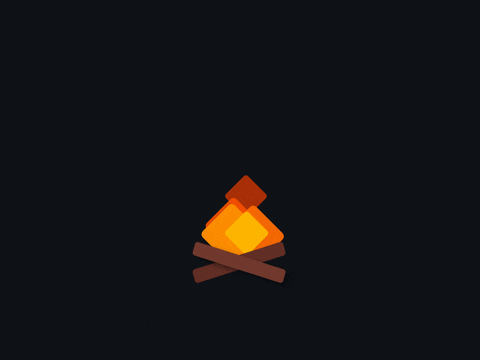

  

  

    <h3> Hi there 👋, I'm Krishna Verma</h3>
    

      I'm a <strong>B.Tech CSE student</strong> passionate about <strong>AI/ML</strong>, <strong>Android development</strong>, and creating intuitive user experiences. 
      I enjoy solving complex problems and exploring cutting-edge technologies like <strong>Kotlin</strong> and <strong>Jetpack Compose</strong>.
    

    

      ✨ Always eager to learn and collaborate on exciting tech innovations! 
      🌱 Currently refining my skills in <strong>AI/ML</strong> and <strong>mobile app development</strong>.
    

    

      Feel free to explore my repositories and connect with me! 😊
    

  

  

###

  
  

###
  

###

  
  
  
  
  
  
  
  
  
  
  
  
  
  
  
  
  
  
  
  
  
  
  
  
  
  

###

  
  
  

###

 

  

