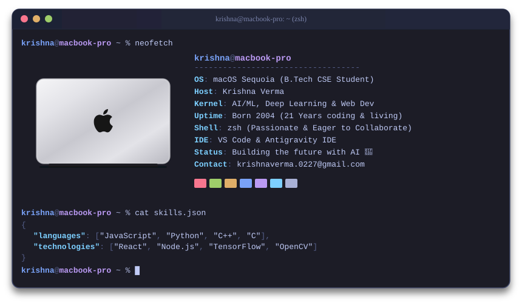

<!-- PROFILE HEADER: macOS Terminal Mockup -->

  

 

<!-- SOCIAL CONNECTS -->

  
  &nbsp;&nbsp;
  
  &nbsp;&nbsp;
  

<!-- TECHNOLOGY STACK -->
<h3 align="center">🛠️ Technology Stack &amp; Toolbox</h3>

  
  
  
  
  
   
  
  
  
  
  
  

 
 

<!-- Github Activity Graph -->

  

 

<!-- GitHub Stats & Top Languages -->

 

<!-- GitHub Streak Stats -->

  

 

<!-- CONTRIBUTION SNAKE ANIMATION -->

  <!-- Note: We use raw link or relative link so that it loads dynamically from your repository -->
  

